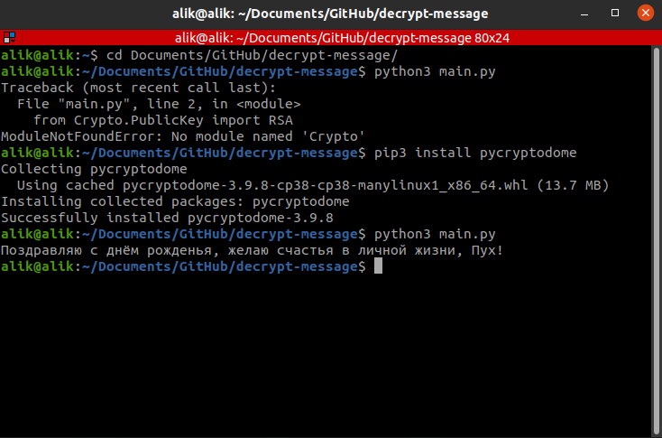

# decrypt-message
 
Задание по дисциплине `Информационная безопасность программного обеспечения`  
Задание выдал: `Лесько С.А.`

Ход работы:  
* Сгенерировать пару ключей: приватный и публичный
* Выслать публичный ключ на почту преподавателя
* В ответ получить задание: зашифрованное сообщение
* Расшифровать преподавателя
* Ответ направить на почту

## Перед началом работы:

1. Загляните в `files/description.md`
2. Заполните все файлы  
2. Установите `PyCryptodome`  
для этого выполините команду `pip3 install pycryptodome`  
Ссылка на документацию: _https://pycryptodome.readthedocs.io/en/latest/src/introduction.html_  
3. Выполните `python3 main.py`  

Пример работы в терминале  

